# Smidge Architecture

This document describes the current architecture of Smidge. The Flutter app in `flutter_app/` is the primary implementation. The root-level React/Babel app is a prototype that mirrors the same product model for fast iteration.

## System Overview

Smidge is a client-only app. UI screens call a small state layer, the state layer calls pure conversion helpers, and persisted preferences are stored locally. There is no backend in the current repository.

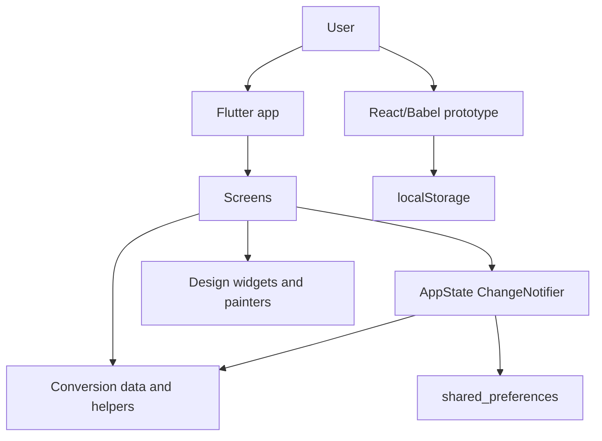

## Runtime Targets

The Flutter implementation supports the platforms scaffolded under `flutter_app/`: Android, iOS, and web. The prototype can be served as static files from the repository root.

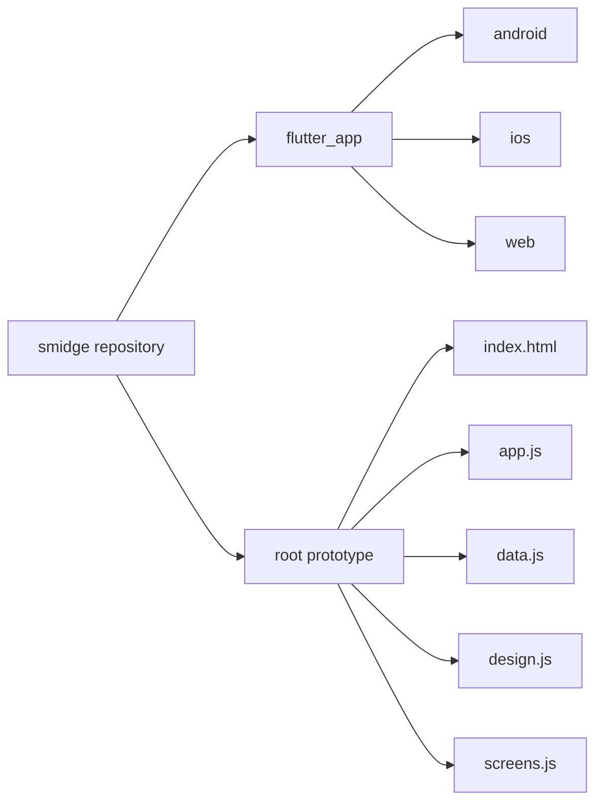

## Flutter Module Map

The Flutter code is split into entrypoint, state, data, design, and screens. Data modules are deliberately pure or nearly pure so conversion behavior remains easy to test.

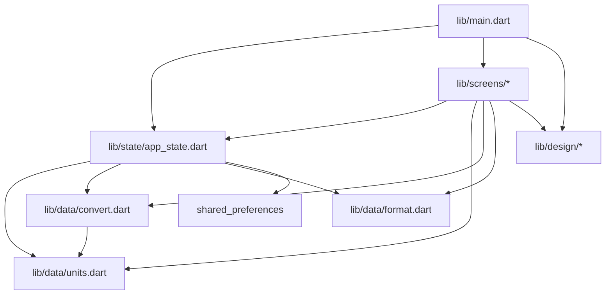

## App Startup

`main.dart` initializes Flutter bindings, sets the system UI overlay, builds `SmidgeApp`, loads `AppState`, checks onboarding status, and then chooses either onboarding screens or the home converter.

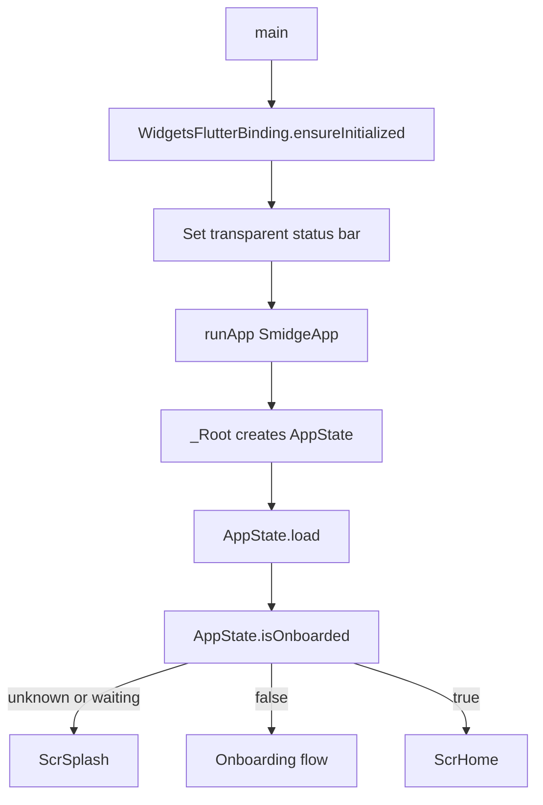

## Onboarding Flow

Onboarding collects category interest, default measurement system, and three pinned conversions. The persisted outputs are onboarding completion, selected system, and pins.

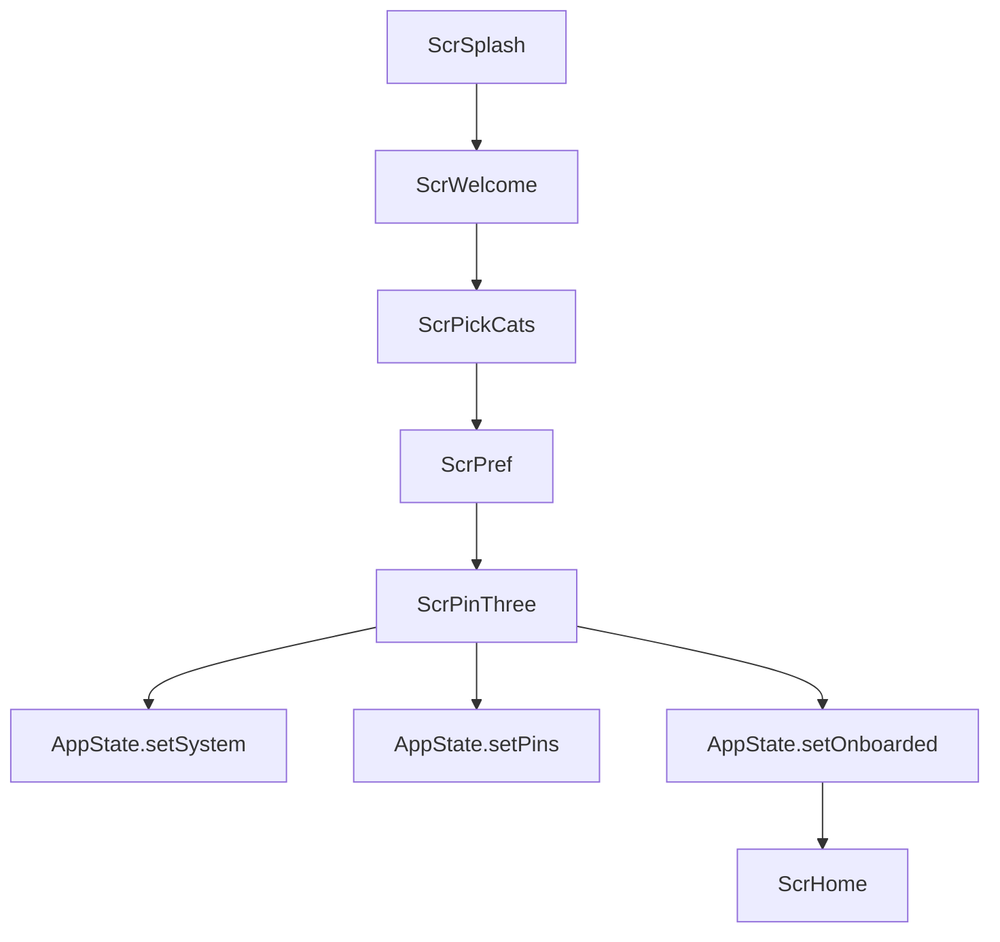

## Screen Navigation

The Flutter app uses `Navigator.push` and `MaterialPageRoute` directly. The home screen is the hub for library, pins, unit picker, multi-unit view, and vertical calculators.

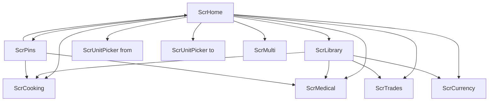

## State Model

`AppState` is a `ChangeNotifier` that stores the active conversion, input expression, focused side, user pins, preferred system, and decimal setting. Mutating methods update memory, notify listeners, and persist.

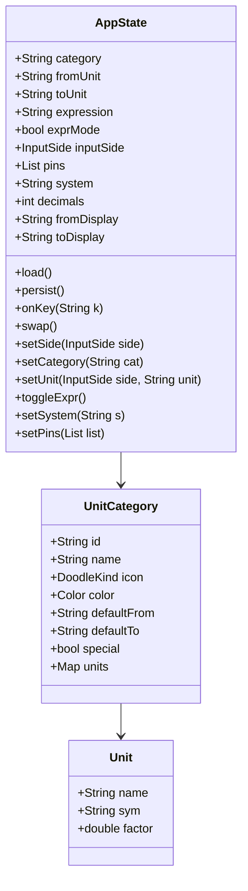

## State Update Flow

The state layer keeps UI updates and persistence in one path. Screens do not write directly to local storage.

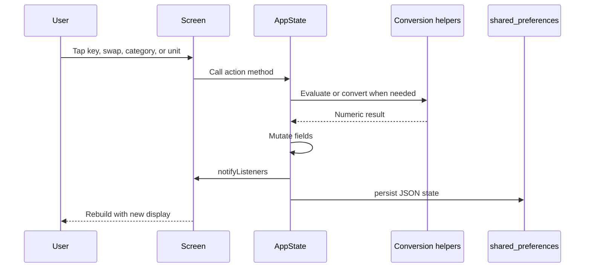

## Conversion Flow

General categories convert through a base-unit factor. Temperature uses custom formulas. Specialist calculators call dedicated helpers.

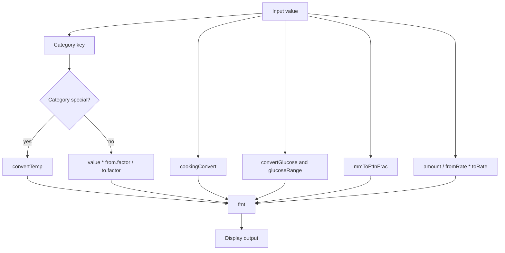

## General Converter Sequence

This is the main home-screen path for categories such as length, mass, volume, area, speed, time, data, pressure, and energy.

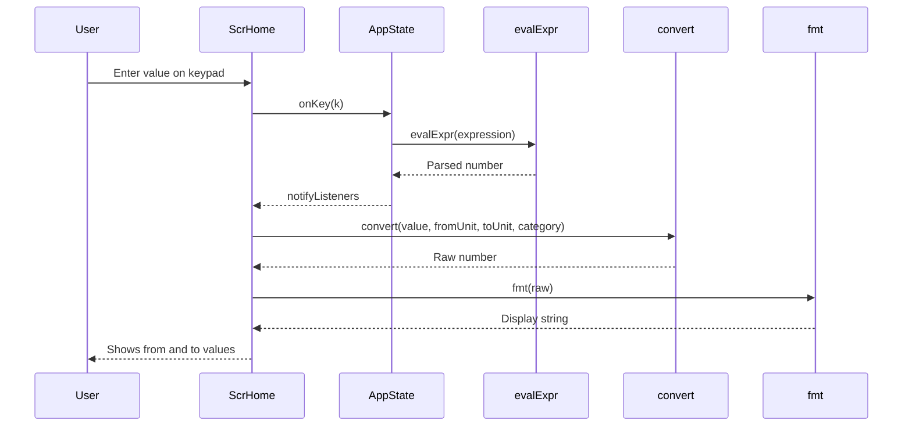

## Specialist Calculator Map

Specialist screens are intentionally separate from the general category system because they need domain-specific data, formatting, or interpretation.

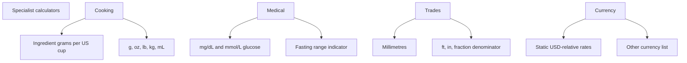

## Persistence

Flutter persistence is a JSON blob plus a separate onboarding marker in `shared_preferences`.

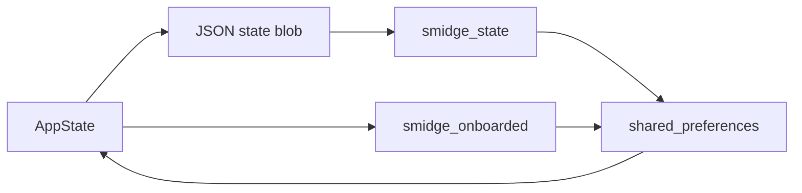

## Design System

The UI uses a compact custom design system instead of a third-party component library. Shared widgets and painters keep the hand-drawn style consistent across screens.

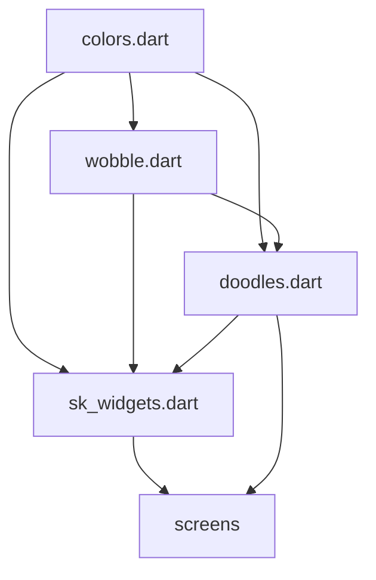

## Prototype Parity

The root prototype keeps a similar conceptual architecture using React state, reducer actions, static data helpers, and browser `localStorage`.

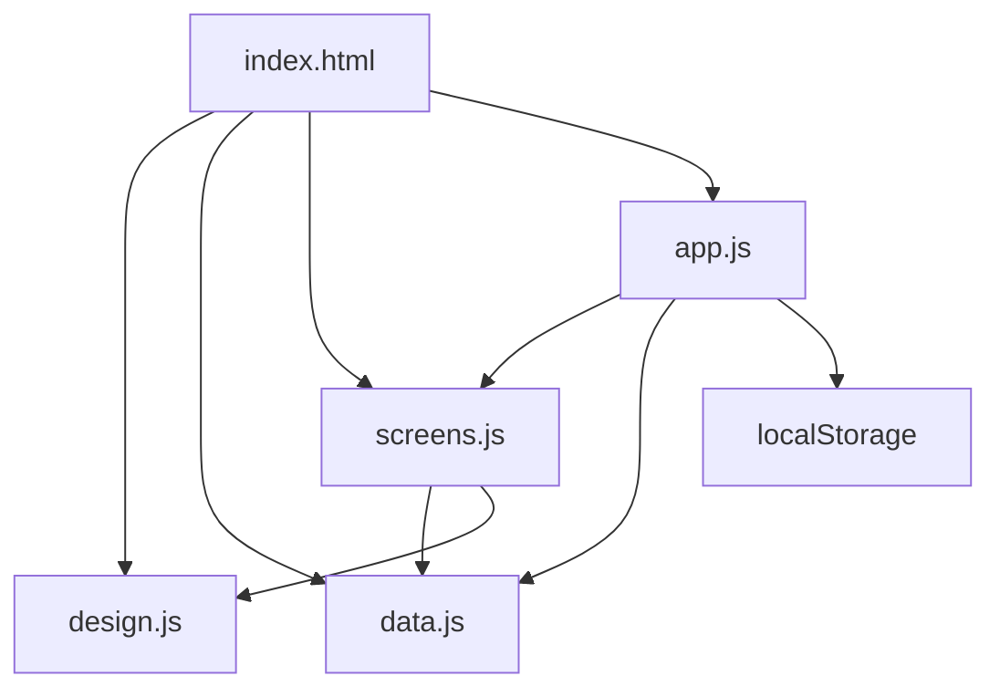

## Boundaries And Current Limitations

- The app is offline-first and has no network integration.
- Currency conversion uses static bundled rates, not live exchange rates.
- Medical context is educational and should not be treated as medical advice.
- Onboarding currently persists system preference, pins, and completion status; category interest is used during onboarding but is not stored as an active category filter.
- State management is intentionally simple and local to `AppState`; there is no dependency injection or repository layer.
